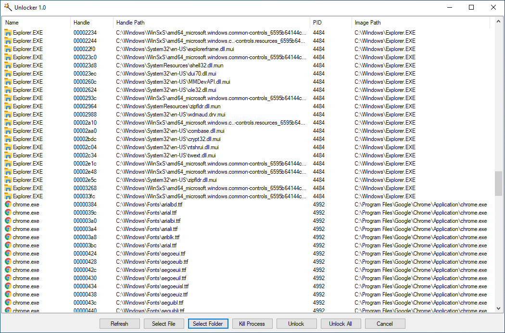

# Unlocker
Unlocker is a tool for Windows that will remove or unlock files and folders that cannot be removed because they're in use by another process.

# basic
vs2019 + net2.0 + c#

# usage
Unlocker.exe -l path  
Unlocker.exe -c handle:pid
